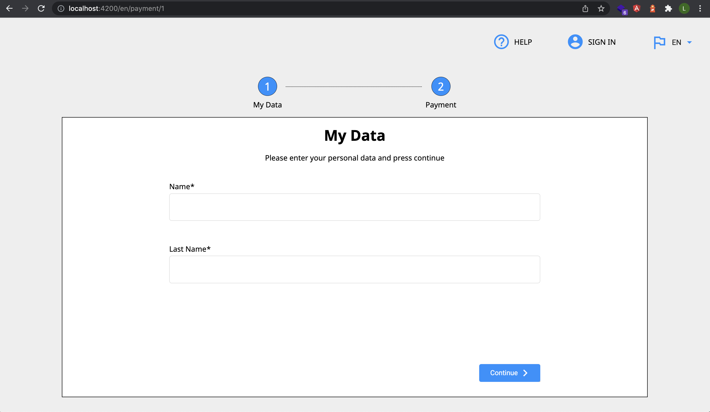

# EC Demo _readme

## Repository

- [LouieC93/ec-demo (github.com)](https://github.com/LouieC93/ec-demo)

## Quick Start

- After cloning the project, open terminal and run `npm i` to install all used packages.
- When installation finished, run `ng s` then open browser and go to `http://localhost:4200/`. You will be directed to the right URL `http://localhost:4200/en/payment/1`.

---

## Structure

- app
    - core: core service like custom httpService, encap-console...
        - httpService: implentment 2 environment to switch between mock data and real API dada.
    - _shared: shared module and other shared component.
    - payment: payment component and router setting.
        - domain
            - payment.service: integrated API sending.
            - payment.management.service: manage data status and map data.
- mock_data: all mock json files is here, with httpService and environment config, it will auto switch between dev-mock mode and real-API mode.

---

## Page Guide

### Step1

- Click select menu at top right corner anytime, it will change the router path and language of displayed text.

- The user-info form has required validator. If you click continue button without filling in anything, you won’t be allowed to go to step 2.

### Step2

- The main content area is scrollable and mobile layout is scrollable too.

### Step3

- When go to step 3, I mock a delay on API send function. Click home button will go back to step 1 with new user-info form.

